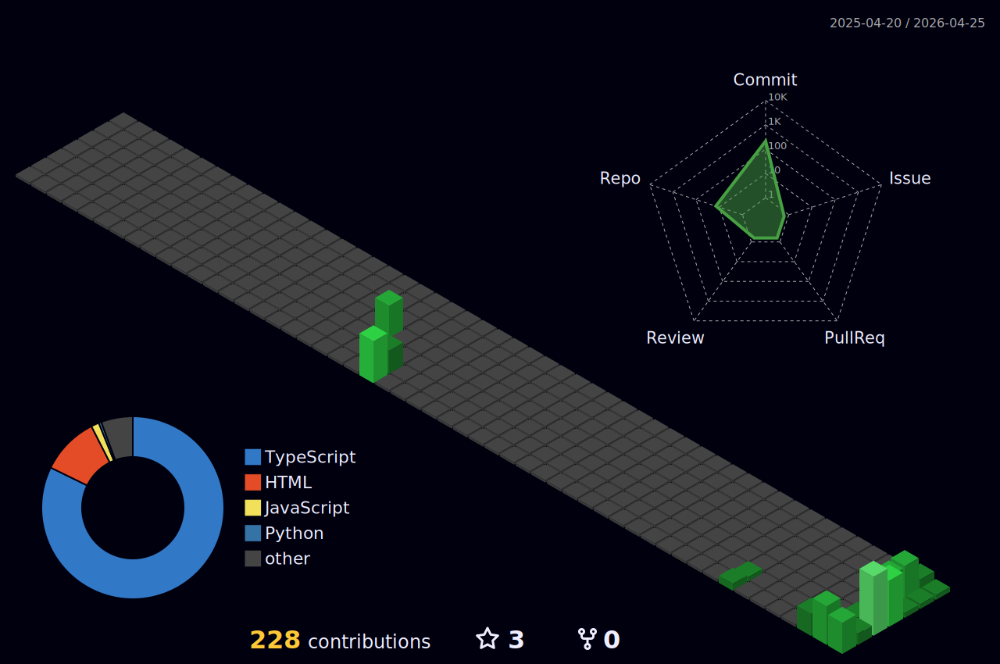

<h1 align="center">Hi 👋, I'm Dibyanshu Sekhar Singh</h1>

  

  
  
  
  
  

---

### 🚀 About Me
I’m a B.Tech CSE student (2023–2027) at **ITER, SOA University** with a primary focus on **Cybersecurity, Networking, and Full-Stack Development**. I love building tools that are both functional and secure.

- 🔐 **Security:** Ethical hacking, wireless testing, and TOR hidden services.
- 🌐 **Web:** Crafting high-performance web apps with modern stacks.
- 📡 **Networks:** Designing complex topologies and enterprise security policies.
- 🍿 **Interests:** Massive GoT fan, Marvel nerd, and anime enthusiast (Weeb).

---

### 📊 GitHub Stats

  

  
  

  

  

#### 🗓️ GitHub 3D Contribution Calendar

  

---

### 🌟 Featured Projects

| Project | Description | Links |
| :--- | :--- | :--- |
| **DexSec** | High-performance, client-side security scanner uncovering browser "digital exhaust". | [GitHub](https://github.com/dexisworking/DexSec) • [Live Demo](https://dexsec.iamdex.codes/) |
| **TravelDex** | AI-assisted travel planner powered by Gemini API + Google Maps API. | [GitHub](https://github.com/dexisworking/TravelDex) • [Live Demo](https://traveldex-phi.vercel.app) |
| **Couplesna** | Long-distance relationship app with real-time features and AI date ideas. | [GitHub](https://github.com/dexisworking/Couplesna) • [Live Demo](https://couplesna.vercel.app) |
| **QuicKards** | High-performance digital business cards and link management. | [GitHub](https://github.com/dexisworking/QuicKards) • [Live Demo](https://quickards.vercel.app) |
| **CNC-Projects** | Portfolio of Cisco Packet Tracer designs for enterprise/industrial networks. | [GitHub](https://github.com/dexisworking/CNC-Projects) |
| **Project-Helix** | Comprehensive CTF WriteUp and security research documentation. | [GitHub](https://github.com/dexisworking/Project_Helix_Write-up) • [Challenge](https://ctf.tcmsecurity.com/) |
| **AuraBoard** | (In Development) Interactive and visually stunning dashboard/aura tracker. | [GitHub](https://github.com/dexisworking/Auraboard) |

---

### 🛠️ Tech Stack
- **Frontend:** React.js, Next.js, TailwindCSS, Bootstrap, Figma
- **Backend:** Node.js, Express, Flask, APIs
- **Database:** MongoDB, Firebase, Supabase, SQLite3, PostgreSQL
- **Security:** Burp Suite, Metasploit, Wireshark, Nmap, Aircrack-ng, Bettercap
- **Languages:** Python, JavaScript, Java, Bash, HTML, CSS

---

### 🤝 Let’s Connect
- 📧 **[dexisforreal@gmail.com](mailto:dexisforreal@gmail.com)**
- 💼 **[LinkedIn](https://www.linkedin.com/in/dibyanshusekhar/)**
- 🐦 **[Twitter (@SekharDibyanshu)](https://twitter.com/SekharDibyanshu)**
- 📸 **[Instagram (@dexisreal)](https://instagram.com/dexisreal)**

  

---

  <i>"Build boldly. Break ethically. Secure relentlessly."</i>

